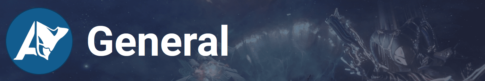
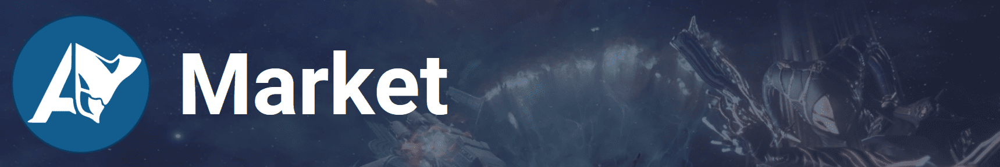
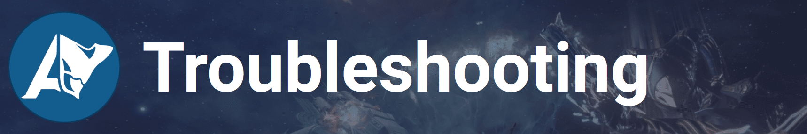

## G1. Is AlecaFrame safe to use?
The short answer is that yes, AlecaFrame is safe to use.

The potentially risky part, getting your account/inventory data, is handled by Overwolf, which is explicitly said to be fine in DE's Third Party Policy: https://support.warframe.com/hc/en-us/articles/360030014351-Third-Party-Software-and-You

A more up-to-date statement from DE: https://forums.warframe.com/topic/1383123-third-party-software-usage/#comment-12964630

Also, AlecaFrame is an app in the Overwolf ecosystem, where all apps are subject to review before publication to ensure that they comply with the terms of service of the game.
(https://support.overwolf.com/en/support/solutions/articles/9000182312-overwolf-won-t-get-you-banned)

Finally, AlecaFrame also does not modify any game files/data or perform any in-game actions, it just displays inventory data in a meaningful way and makes your life easier overall.

## G2. What personal data does AlecaFrame collect and what do you do with it?
All settings/data are stored locally, and they are not sent to any server. GA (Google Analytics) is used, but in a totally anonymous way, and is mainly used to keep track of how many times a feature is used. The only exception to this are your personal stats, but as it is explained in the "API & Data export section", they are stored in a totally anonymous way. 
ㅤ
## G3. Is AlecaFrame open-source?
No, but AlecaFrame has been intentionally designed in a way so that all the code that is running on your computer can be easily read/checked.
The .NET (C#) libraries haven't been obfuscated and even have debug symbols on them. You can use tools like ILSpy to check the source code.
The UI (HTML, CSS, JS) hasn't been minimized or changed in any meaningful way. You can check those files with any text editor.

## G4. I want to contribute to the development of AlecaFrame, how can I do it?
~~I am currently looking for people to help with the development, so if you think you are the right person, let me know.~~
I am planning on opening the frontend/web app of AlecaFrame for public contributions, more details soon.

## G5. I just subscribed to the app in Overwolf and I want to get my Discord role
First of all, thank you so much! ♥️
Just DM me on Discord and I will make sure you get the role

## G6. When is my inventory data updated? How can I force it?
Due to Overwolf limitations, the data only updates during log-in or loading screens.
So if you want to force it to update, just travel to your clan DOJO or RELAY and then back to your ship. (Any mission also works) 

## G7. How can I get the "Content Creator" role in Discord?
There is a minimum requirement of 5K avg. YouTube views per video or 50 avg. viewers in Twitch or equivalent. Feel free to DM alecamar in the Discord server if you meet those requirements or have any questions.

## M1. How do I get a WFMarket account?
You can create and VERIFY your WFMarket account here: https://warframe.market/

## M2. I already have a WFMarket account but I log in with Steam/Discord. What can I do?
You can add an email/password login in your WFM account settings.

## M3. My WFMarket account is verified but I am still getting an error message saying it is not. What can I do?
If you are logged into WarframeMarket in AlecaFrame, try logging out and back in.
If you are getting this error while logging in, try changing your WFMarket email. 

## T1. Where can I find the log files?
If you are having an issue, I might ask you for one of these two types of logs:
1. Relic logs: Press the key combination Windows+R and then enter: %localappdata%\AlecaFrame\relicLogs
2. Overwolf logs: Right-click on the Overwolf icon on the bottom right corner, click "Support" and then "Create logs zip"

## T2. I use GeforceNow or another game streaming service to play Warframe. Can I still use AlecaFrame?
Unless you can install AlecaFrame on the same computer where the game is running, no.
This means that if you are using [Shadow](https://shadow.tech/en-GB) (or any other service that lets you install arbitrary apps or games) you can use AlecaFrame, but if you using something more restrictive (like GeForce Now), you can't.

## T3. I can't install the app because Overwolf says that Windows Insider versions are not allowed. Is there any way around it?
Yes! Follow this tutorial: https://support.overwolf.com/en/support/solutions/articles/9000197893-windows-insider-support-removal#override1

## T4. Do I need to start AlecaFrame/Overwolf before launching the game?
Unfortunately, due to internal limitations, you do. If you forgot to do it, just restart Warframe and it should work again.
Luckily, if Overwolf is set to run on startup, it will automatically launch AlecaFrame for you when the game opens. 
ㅤ
## T5. AlecaFrame is showing a yellow/red error box. What can I do? 🟥 🟨 🟩
There are a few things that you can try:
You NEED TO be logged in to the game for the data to be available.
Sometimes entering and exiting a level (open world, relay, or mission) or restarting the game fixes the issue. If those things still don't work, keep going on this checklist.
Make sure Warframe/AlecaFrame is enabled in the Overwolf settings "Overlay & Hotkeys" tab
Warframe needs to be started AFTER Overwolf/AlecaFrame is opened. (In other words, open AlecaFrame/Overwolf first, and then the game)
Make sure Warframe/The launcher/Steam is NOT running as an admin. (Or alternatively, close Overwolf and launch Overwolf as an admin (Not the app, but Overwolf))
If you are running an old version of Overwolf, updating it to the latest version might help.
If it still doesn't work, feel free to ask in ⁠support-issues
ㅤ
## T6. The relic overlay is not working (not showing up)
If other similar programs like WFInfo are running at the same time, AlecaFrame might not work properly. Make sure you close them before opening a relic.
Also, make sure you enable the overlay for AlecaFrame in the Overwolf settings menu.

## T7. The relic overlay is showing the wrong rewards
For the time being, you need to make sure that the game language is set to English and that the screen size is at least 1080p. At lower resolution, it might still work, but it is not technically supported. ALL themes are supported and should work well, but if you are having issues, it might help to switch to the default one while trying to troubleshoot the issue.

## T8. Will AlecaFrame work for my screen resolution/aspect ratio?
AlecaFrame is optimized for screens with a minimum vertical size of 1080px, both 16:9 and ultrawide. Smaller screens (like 1366×768) should still work but the UI might get stretched in unexpected ways. 

## T9. I am getting this error when I open a relic: "...Please make sure your WARFRAME SCALING SETTINGS are up to date..."
AlecaFrame needs to know your scaling settings to detect the relic rewards. Copy your scaling settings from the game to the application as seen here: https://imgur.com/a/NeIm7d9

### If you play on a very low resolution (less than 800 vertical pixels)
You can also try to set the game to fullscreen to force a higher resolution. Change the resolution to something with vertical pixel count higher that 1080. Set the dynamic resolution (Options > Video > Advanced) to ratio of your old resolution and your new one. For example: set the resolution to 2x of what you had (800x600 to 1600x1200) and then change the dynamic resolution to 50%
If the game does not offer higher resolutions, you can change Windows' resolution or set it manually by changing EE.cfg config file. Graphics.FullScreenSizeX and Graphics.FullScreenSizeY in https://warframe.fandom.com/wiki/Settings/Config

## T10. Warframe is crashing when AlecaFrame is opened / The overlays are not showing up
If you have RivaTuner installed, these kind of issues might be happening due to some incompatibilities with Overwolf.
You can just close/disable RivaTuner or try setting the InjectionDelay to > 6000 in the RivaTuner Warframe profile or global profile. (Found at C:\Program Files (x86)\RivaTuner Statistics Server\Profiles)
You will probably have to restart RivaTuner after changing any of its settings. 

## T11. The app looks blurry, what can I do?
Most of the times changing your Windows scaling configuration will fix it, but if it doesn't, you can also try disabling hardware acceleration in Overwolf (Overwolf settings > General and disabling hardware acceleration). This will make AlecaFrame run slower, so you should only do this if nothing else works

## T12. The Windows notifications sometimes don't pop up / appear after a while
Try disabling "Focus assist" if you are running Windows 10/11

## T13: I can't see the relic overlays while playing, what can I do?
This link might help: https://support.overwolf.com/en/support/solutions/articles/9000202391-overlay-troubleshooting

## T14: The troubleshooter says Warframe is running as an admin but it is not. What can I do?
If you launch Warframe from Steam, make sure the "Run this program as an administrator" setting is not enabled on both Warframe and Steam: https://imgur.com/a/V6M585L. Then restart Steam/Warframe for the changes to apply.
Having Steam/Warframe are installed in a folder/disk that is protected/belongs to another user it might also cause this issue.

## T15: The relic overlay only works in windowed or borderless mode, can it also work in fullscreen mode?
Yes, it usually works in any mode if you are running Windows 10/11. If you are in Windows 10/11 and it doesn't, make sure that the "Disable fullscreen optimizations" option is NOT enabled in the properties menu of the Warframe executable: https://imgur.com/a/kUipZkf 