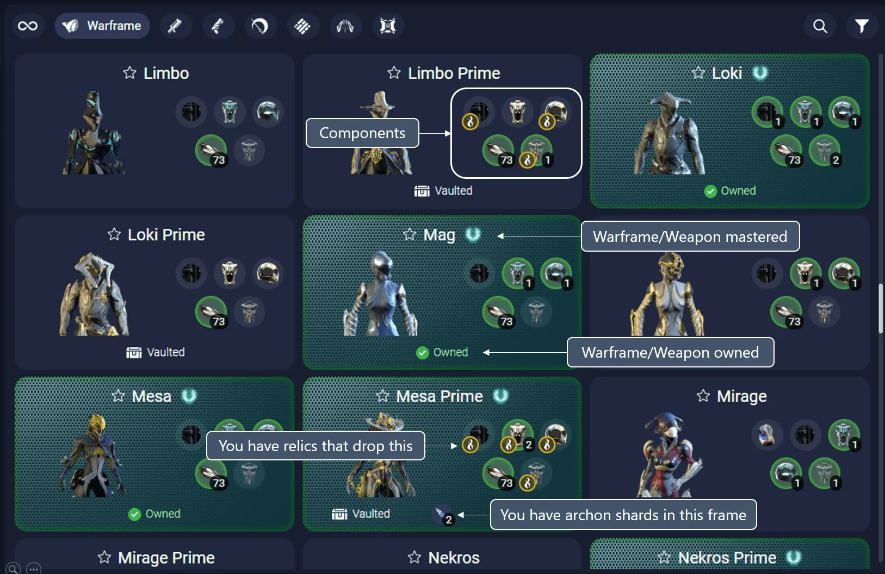
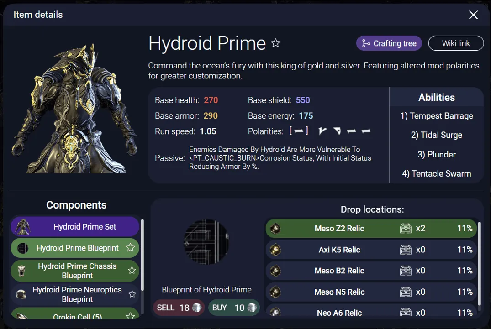
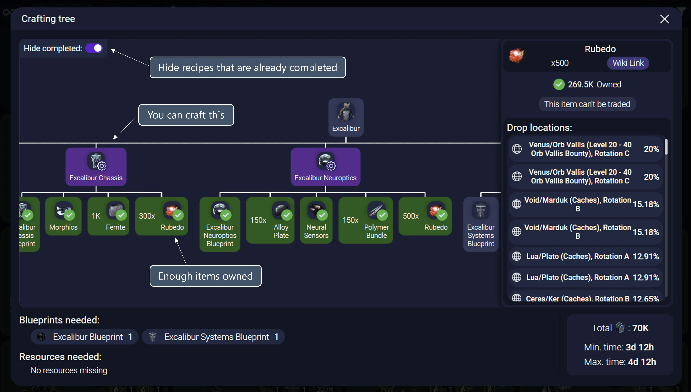

# Foundry

This tab displays your Warframe unlocks, providing a quick glance at what you have, what's mastered, and what's available.

## Labels and Indicators

- **Warframe/Weapon mastered**: This label is placed on items that you have fully leveled up to the maximum rank. (You might not own the item anymore, but it still counts as mastered)

- **Warframe/Weapon owned**: Indicates that you currently have the item in your inventory.

- **Vaulted**: A tag showing that the Warframe or weapon is currently vaulted.

- **You have relics that drop this**: A helpful note that you possess relics which can potentially drop this component.

- **You have archon shards in this frame**: Indicates the presence of archon shards in the specific Warframe.

## Filters

With the controls in the top you can search and further refine the results.

- **Type filter**: At the top, tabs are available to switch between different categories such as Warframes, weapons, etc.

- **Search Bar**: Located at the top right, It also includes the names of the components in the search.

- **Filters**: Icons for filtering content and accessing settings are aligned horizontally at the top.

### Type
- **Prime**: Filters to show only Prime Warframes and weapons.
- **Normal**: Filters to show only standard Warframes and weapons.

### Mastery
- **Mastered**: Displays only items that you have leveled up to the maximum rank.
- **Unmastered**: Shows items that have not yet been leveled to the maximum rank.

### Owned
- **Yes**: Filters to display only the items you currently own.
- **No**: Shows items that you do not own.

### Vaulted
- **Yes**: Lists only the Warframes and weapons that are vaulted.
- **No**: Displays items that are currently not vaulted.

### Ready to Build
- **Yes**: Shows items for which you have all the necessary components to build.
- **No**: Displays items that you cannot build yet due to missing components.

### Enough Mastery
- **Yes**: Filters the items that you have enough mastery rank to use.
- **No**: Shows items that are above your current mastery rank.

### Prime Resurgence
- **Yes**: Displays items available through the Prime Resurgence event.
- **No**: Filters out the Prime Resurgence items.

### Used for Crafting
- **Yes**: Lists items that can be used in crafting other items.
- **No**: Shows items that are not used in crafting.

### Favorite
- **Yes**: Filters to show only items marked as favorites.
- **No**: Displays items not marked as favorites.

### Helminth Done
- **Yes**: Displays items that have been interacted with the Helminth system.
- **No**: Shows items that have not been used with the Helminth system.

### Contains Archon Shards
- **Yes**: Filters to show warframes that contain archon shards.
- **No**: Displays warframes without archon shards.

## Foundry details window
You can click any item in the foundry to see more details:

Depending on the type of item, different stats will be shown:
- **Warframes and companions:** Base stats (health, shield, energy,..), abilities and description.
- **Weapons:** Attack type, noise and amount of damage and type for each different attack mode of the weapon.
- **Mods and arcanes:** Benefits at each level and cost (in endo and credits)
### Component view
In the bottom of the foundry details window you can inspect each component of the crafting recipe, see a list of relic or places where you can obtain it or just buy/sell it from Warframe.Market.

## Crafting tree view
If an item has a crafting recipe available, you can see its full crafting tree by clicking the "Crafting tree" icon in the top right corner of the foundry details window.

At the bottom of the crafting tree window you can also see the total amount of resources and blueprints that you will need if you want to build that item. It **takes into account** the parts you have already built.