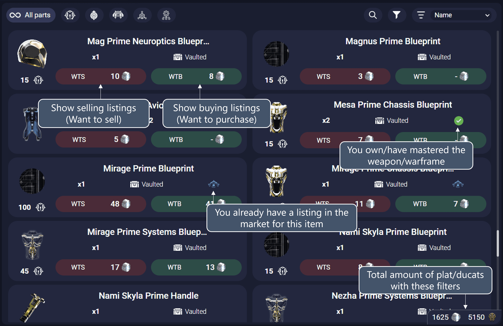
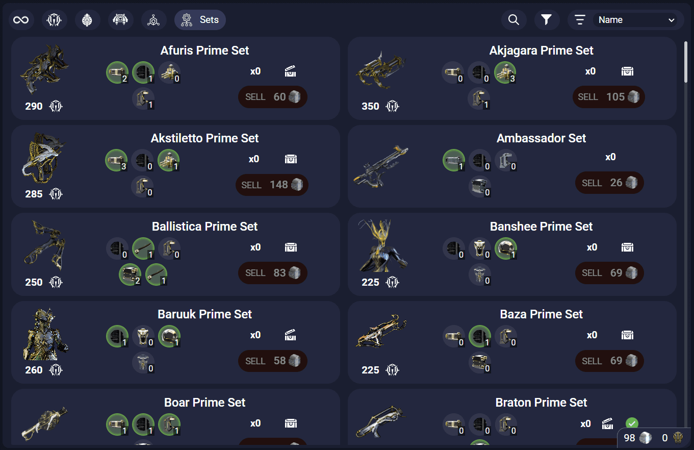

# Inventory

This tab shows all the items that you have in your Warframe inventory that can be sold in Warframe.Market. It lets you create listings for the items you want in 1 click.

## Filters

### Item Crafted
- **Mastered**: Shows only parts for items that have been mastered.
- **Unmastered**: Shows only parts for items that have not yet been mastered.

### More Than One Owned
- **Yes**: Filters to show items of which you own more than one copy.
- **No**: Displays items of which you own only one copy.

### Vaulted
- **Yes**: Lists only the parts for items that are currently vaulted.
- **No**: Shows parts for items that are not vaulted.

### Order Placed
- **Yes**: Filters to show items for which you have placed an order (on Warframe.Market).
- **No**: Displays items for which no order has been placed.

### Part Type
- **Normal**: Displays standard items.
- **Prime**: Filters to show only Prime items.

### Favorite
- **Yes**: Shows only items that you have marked as favorite.
- **No**: Shows items that are not marked as favorite.

### Minimum Platinum
- **5**: Filters items with a minimum value of 5 platinum on the market.
- **10**: Displays items with a minimum value of 10 platinum.
- **15**: Shows items with a minimum value of 15 platinum.

### Set Complete
- **Yes**: Filters to show only complete sets of items.
- **No**: Shows sets (or parts) belonging to non-complete sets.

### Equipped (Mods only)
- **Yes**: Shows mods that are currently equipped.
- **No**: Displays mods that are not equipped.

### Leveled Up (Mods & Arcanes)
- **Yes**: Filters to display mods and arcanes that have been leveled up.
- **No**: Shows mods and arcanes that have not been leveled up.

## Sets filter

When the sets filter is selected (last rounded button on the top-left corner), AlecaFrame will show sets where you have at least 1 part. The "Sell" button will appear disabled if you don't have all the necessary parts to be able to sell a full set.

