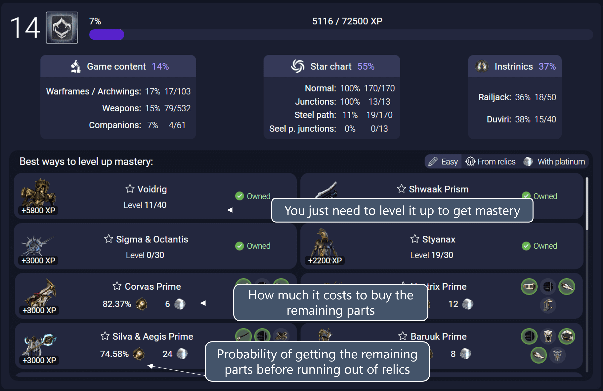

# Mastery helper

This tab helps you increase your mastery level (needed to unlock more weapons, max daily standing and more) in the easiest possible way.

## Filters

### Filter: Easy

The "Easy" filter shows things where you don't need to do anything to increase your mastery level. For example, it will tell you which weapons/warframes you can level up to get XP, which intrinsics you are missing and even if there are items ready to be crafted that could potentially be leveled up for the first time.

### Filter: From relics

The "From relics" filter shows all items that can be crafted from parts obtained from relics that you own. Right below the name of the item you can see how likely you are to get all the neccessary components before you run out of relics. They are also ordered by most likely to least.

### Filter: With platinum

The "With platinum" filter shows all items that can be crafted by purchasing from Warframe.Market the parts that you down own. Right below the name of the item you can see how much it would cost to get all the neccessary components. They are also ordered by lowest price to highest.

## Notes

The total mastery calculation might not always be 100% correct, and it is expected to deviate from the real value by +-100XP points. This doesn't matter that much most of the times and it is nearly impossible to solve since (as far as I know), there is no public list of how much mastery XP each map node gives.