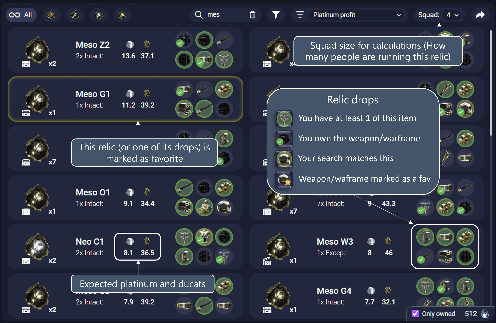
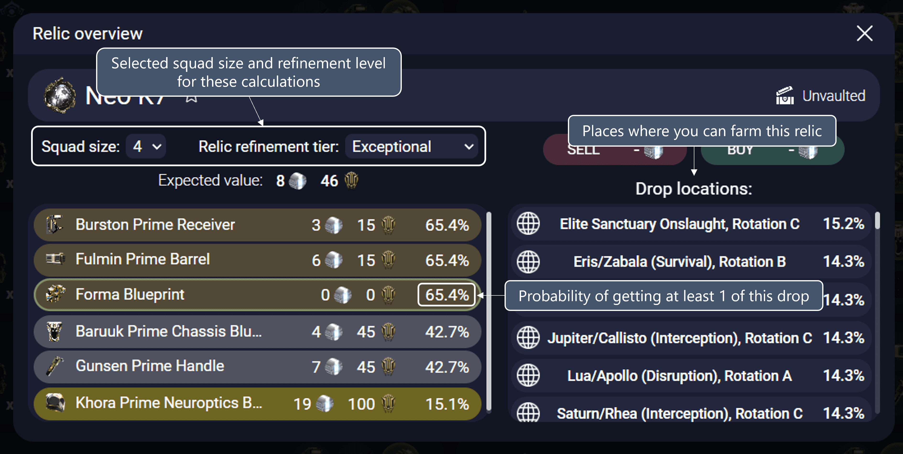

# Relic Planner

This tab helps you choose which relic you want to open next.

## See relics not owned or other tiers

If you want to see all the relic currently in Warframe, you can uncheck the "Only owned" checkbox in the bottom-right corner of the "Relic planner" tab.

## Squad size

"Selected squad size" means how many people in your squad are running this relic at the same time.

Changing this value will affect the expected platinum/ducats as well as the overall drop rates for at least 1 copy of a drop.
If time-efficiency is the main concern (lowest time to get x), every person in the squad should run the same relic.
If relic-efficiency is the main concern (the relics are valuable, expensive, or unbontainable), only 1 person in the squad should run the relic at the same time.
You should evaluate which strat you prefer and choose accordingly by comparing the expected drop rates and profit for each squad size.

## Exporting current view to the recommendation overlay

If you want to export the current view (filters, search and ordering) to the relic recommendation overlay, you can do so with the arrow icon in the top-right corner.
After this is done, whenever the recommendation overlay open, it will use those fiters to show the best relics to run.
If you want to reset them, just remove all filters and click the arrow icon again.

## Filters

### Vaulted
- **Yes**: Displays only relics that are vaulted.
- **No**: Shows relics that are currently not vaulted.

### All Rewards Owned
- **Yes**: Filters to show relics where all potential rewards have been owned.
- **No**: Displays relics with rewards that are not fully owned.

### All Items Mastered/Owned
- **Yes**: Shows only relics for which all the weapons/warframe whose parts can be dropped are both mastered/owned.
- **No**: Displays relics for which all the weapons/warframe whose parts can be dropped are not mastered/owned.

### >= 10 Copies
- **Yes**: Filters relics of which you have 10 or more copies.
- **No**: Shows relics with fewer than 10 copies.

### Relic Tier
- **Intact (Int.)**: Displays all relics in their intact state.
- **Exceptional (Exc.)**: Displays all relics in the exceptional state.
- **Flawless (Fla.)**: Displays all relics in the flawless state.
- **Radiant (Rad.)**: Displays all relics in the radiant state.

### Favorite
- **Yes**: Filters to show only relics marked as favorites (themselves or any drop, warframe or weapon in them)
- **No**: Shows relics not marked as favorite (Not favorite themselves or any drop, warframe or weapon in them)
- **Order First**: Sorts the relics to show favorites (themselves or any drop, warframe or weapon in them) at the top of the list.

## Ordering modes

- **Platinum Profit**: Sorts relics by the amount of platinum profit they can potentially yield. (At the current squad size)
- **Ducats Profit**: Orders relics based on the ducat profit they could bring. (At the current squad size)
- **Missing Items (Best for MR)**: Sorts relics by the items missing from your collection, prioritizing the ones that contribute to Mastery Rank (MR) progression.
- **Name**: Alphabetically orders relics by their name.
- **Amount**: Sorts relics by the quantity you own.
- **Best to Upgrade - Platinum**: Orders relics based on the efficiency of upgrading them to radiant in terms of potential platinum profit, considering the cost of void traces.
- **Best to Upgrade - Ducats**: Sorts relics by the efficiency of upgrading them to radiant in terms of potential ducat profit, taking into account the void traces spent.

## Relic details

By clicking any of the relics you can open a new window with more details about it:

