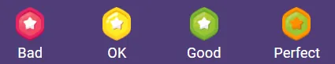
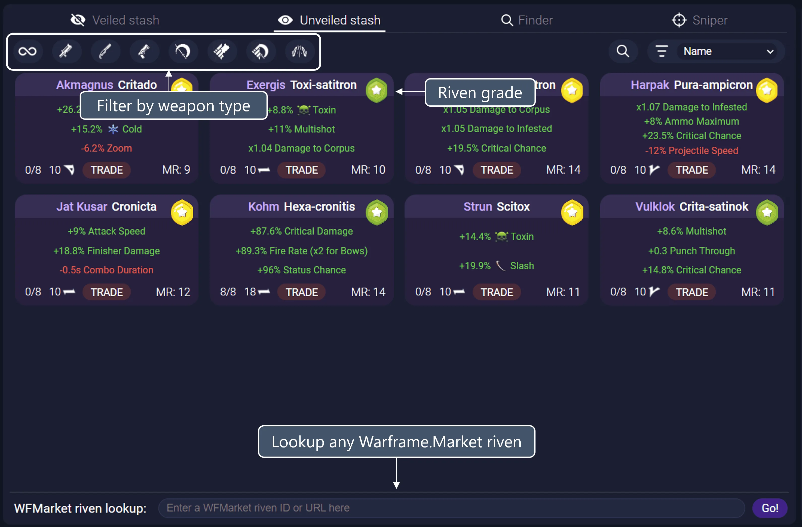
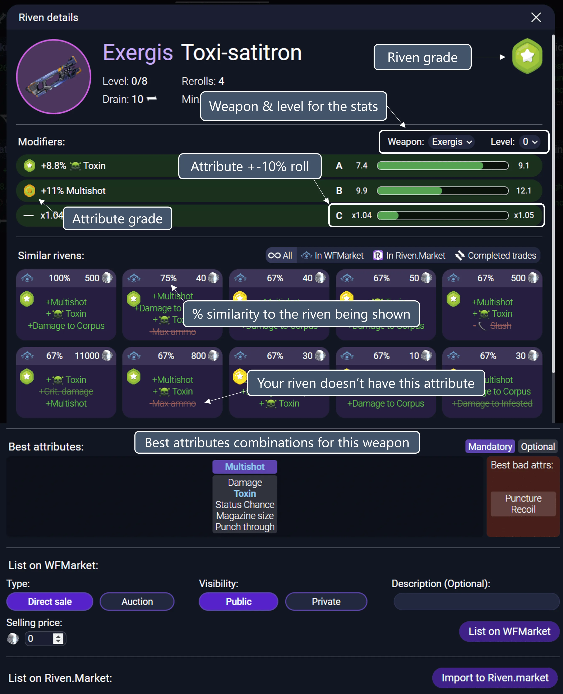
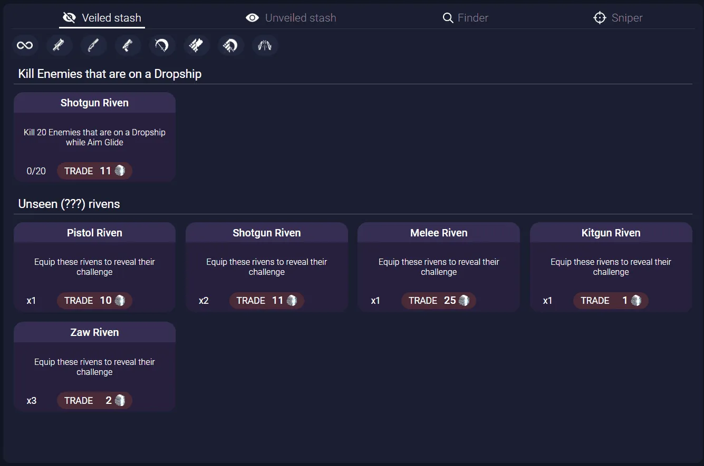
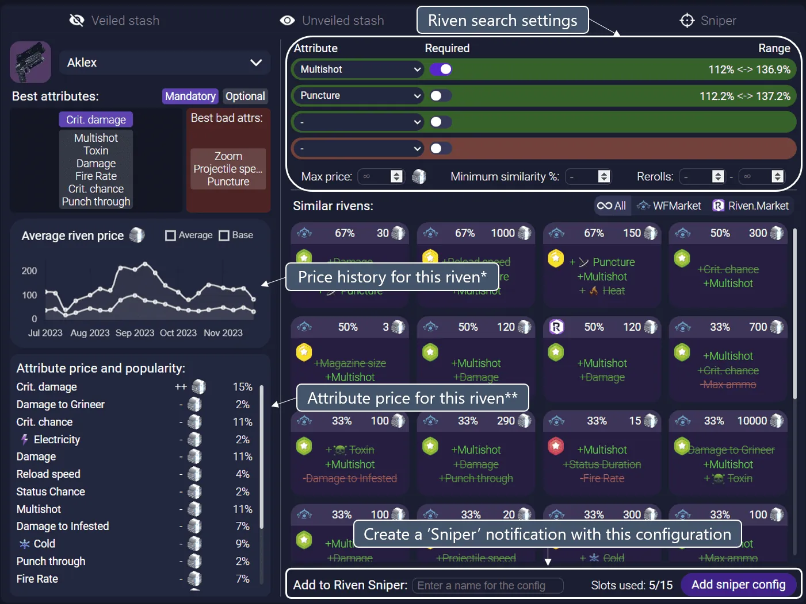
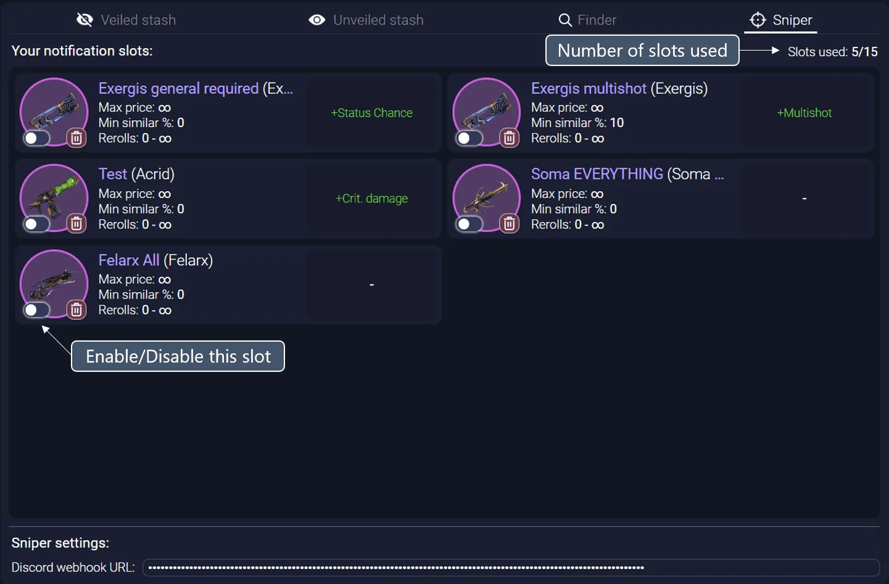

# Riven explorer

## Riven grades

The grading system used in AlecaFrame is made of four different tiers:

- **Great**: All the attributes in this riven are considered good for the weapon.
- **Good**: This riven is good enough for most builds. Most of its attributes help the weapon and it is generally worth replacing another existing mod by this one.
- **OK**: Not all attributes in this riven are considered good or its negative attribute might be detrimental to some builds.
- **Bad**: This riven has no good attributes or a negative attribute so detrimental that it is useless for most builds.

The individual random roll (+-10%) to the strength of each attribute has no effect in the overall grade of a riven.

What AlecaFrame considers a 'good/bad' attribute is based on the great work done by 44bananas#9024 and Xennethkeisere#0717 [Link](https://docs.google.com/spreadsheets/d/1zbaeJBuBn44cbVKzJins_E3hTDpnmvOk8heYN-G8yy8)

If you feel like a certain grade is wrong or not fair for a certain riven, feel free to post about it in our Discord server. But please remember that rivens are quite subjective, and what you think works really well for a certain build might not be generalizable for all people.

## Unveiled rivens

### Ordering Options

- **Name**: Alphabetically sorts Rivens by their name.
- **Disposition**: Orders Rivens based on their disposition, which reflects the mod's potential strength relative to the popularity of the weapon it's for.
- **Required MR**: Sorts Rivens by the Mastery Rank (MR) required to use them.
- **Rerolls**: Orders Rivens based on the number of times they have been rerolled.
- **Stat Perfectness**: Sorts Rivens by how ideal the random stats are, with more perfect stats overall coming first.
- **Riven Grade**: Orders Rivens according to their grade, which is be indicative of their overall general quality/usability.

## Riven details

### Good rolls

What AlecaFrame considers a good/bad attribute combination is explained [here](#riven-grades).
One weapon might have more than one combination of mandatory/optional attributes that are considered a good 'roll'.

Any attributes that match the current riven will be highlighted and shown in a different color.

## Veiled rivens

## Riven finder

The 'Finder' tool is designed to let you find your dream riven or easely check what the best pricing for a riven that you own is. If you want to be notified when a riven like the one you are looking for is put for sale in any of the markets, you can add it to the "Sniper".

### Average riven price graph (*)

- **Average price**: This price is the average price of the rivens traded during the last 15 days for this weapon excluding outliers.
- **Base price**: This value tries to guess what the base price for any riven (no matter how bad/good the rolls are) of this weapon is. This value is useful for determining a price for a riven that you are selling/buying with rerolling in mind.

### Attribute price and popularity (**)

The attribute populrity is the % of traded rivens where this attribute was found. The higher it is, the more likely it is that people consider it 'useful'.

The attribute price reflects how this attribute affects the price of a riven:
- **+++**: The presence of this attribute adds at least '1xAverage Price' to the value of the riven.
- **++**: The presence of this attribute adds between '1xBase Price' to '1xAverage Price' to the value of the riven.
- **+**: The presence of this attribute has little to no effect in the price of the riven, but its contribution is overall still positive.
- **-**: The presence of this attribute has no positive impact on the price of the riven.

Users that support the developement of AlecaFrame in [Patreon](https://www.patreon.com/AlecaFrame) have the option to show the real platinum values instead of the "++" and "-" signs.

### Adding a configuration to the 'Sniper'

If you want to be notified whenever a riven that matches your selected filters is listed to any of the markets (currently Warframe.Market and Riven.Market), you can add the current filters to the riven sniper.

## Riven sniper

### Sniper slots

Notifying users is something that doesn't scale well and requires quite a bit of computational resources for a large number of users. Therefore, the number of notification slots is limited (currently to 5).

This limit can be increased by supporting AlecaFrame in [Patreon](https://www.patreon.com/AlecaFrame).

Disabled slots still count towards this limit.

### Sniper notifications

To receive sniper notifications, you need to create a [Discord Webhook](https://www.youtube.com/watch?v=fKksxz2Gdnc) (Until minute 0:51) and then paste the Webhook URL in the bottom of the 'Sniper' tab.

If your sniper link is invalid or becomes inactive, AlecaFrame will replace it to inform you about it.

### Sniper speed

The sniper has been designed with speed in mind, so that you have the most chances to be the first one to buy the riven.

Based on initial tests, the AlecaFrame 'Riven Sniper' is the fastest one, usually delivering notifications 5-15 seconds earlier than the next best one.

There are **no** artificial delays, but premium users ([Patreon](https://www.patreon.com/AlecaFrame) and Overwolf supporters) will get the notification first if many people are subscribed to the same riven.

### Inactivity

If you are inavtive (haven't used AlecaFrame) for more than 30 days, you will stop receiving notifications.

Once you open AlecaFrame, you will start receiving notifications again.

