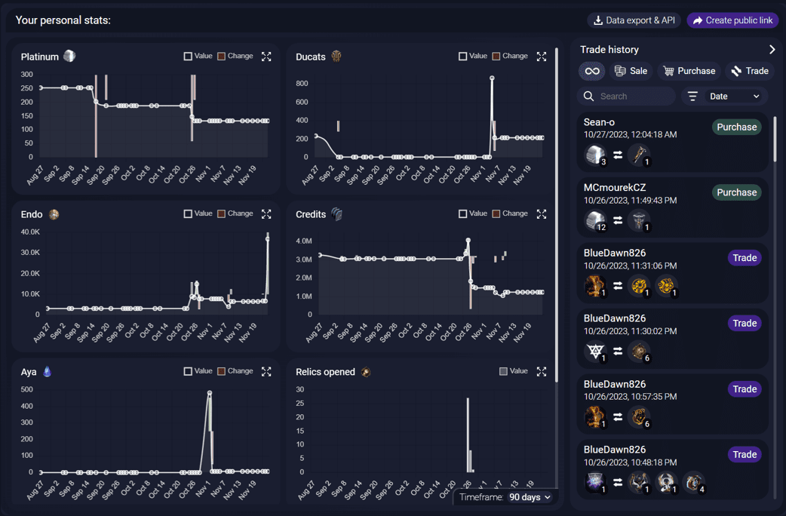

# Stats

The Stats tab will record some datapoints (Platinum, Ducats, ...) and trades when you play with AlecaFrame open. You can then go back to this tab and see how you have progressed through the game or check the trades you have done.

## Data export and API

You can export your data and trades in both CSV and JSON format. After you start the export, a file with the data will be created in your desktop.

These files will include all the data that the Stats tab has recorded. (So pretty much all that you see displayed in the graphs and the trade history)

Swagger documentation for the Stats API: [Docs](https://stats.alecaframe.com/api/swagger/index.html)

## Sharing and public links

If you want to share your stats with a friend or a clan, you can create a public sharing link with the information you want to share.

These links are valid for up to a year and will show up to date information (Not just a snapshot in time).

## Data storage and anonymity

All data is stored in a totally anonymous way, fully compliant with the "anonymous" GDPR definition (GDPR art.26). Only you (the player) know your "userHash" and therefore only you can access your data.

You can also fully disable the stats tab (including the recording of data) in the settings menu.

As a side-effect of this anonymity, if you change your Warframe username, you will have a new "userHash" and therefore, you will lose your old data.

## Data deletion

If you want to fully delete your data, please DM alecamar on Discord (You can find me by joining the [Server](https://discord.gg/NAmRn9rn2V)) asking about this. Don't forget to also mention your "userHash".

## Language compatibility

Check [this table](/language-compatibility.html) for more information.
