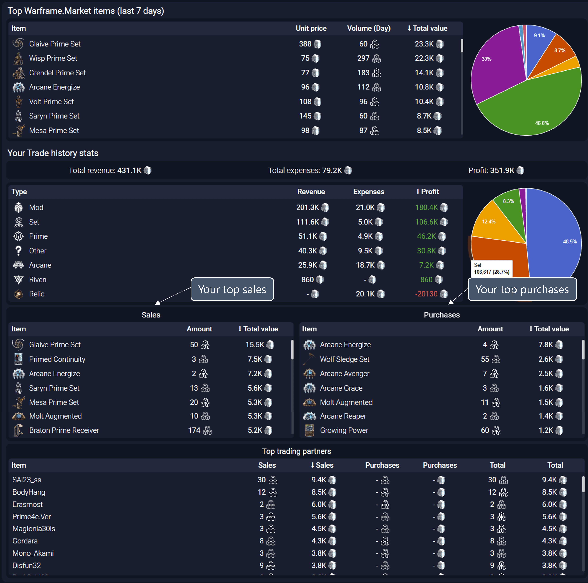

# Trading Analytics 👑

This tab is only available to Patreon T2+ supporters.

## Where is this data coming from?

Warframe.Market related data (like the trading volume and value) come from directly processing Warframe.Market data and internal AlecaFrame metrics.

Everything else uses your trade history (Stats tab). So the longer your have used AlecaFrame, the more data this tab will have to work with.

## Language compatibility

Check [this table](/language-compatibility.html) for more information.

