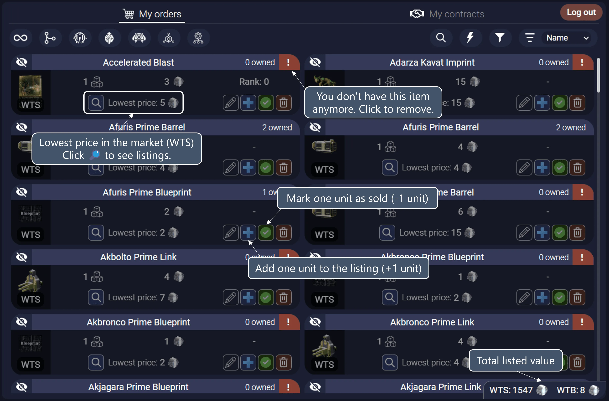

# Warframe.Market

After linking with your [Warframe Market](https://warframe.market/) account, this tab will show the listings and contracts of your Warframe.Market account.

## Logging in and out

You can log out of your [Warframe Market](https://warframe.market/) account by clicking the "Log out" button on the top-right corner of the tab.

If you use Steam, Discord or any other method to login to [Warframe Market](https://warframe.market/), please check the [FAQ](../faq) for more info.

## Fixing listings

When a listings has a "!" icon, it means that AlecaFrame couldn't find the listed item in your Warframe inventory.

You can manually edit/remove the listing or just click the "!" icon and AlecaFrame will adjust the quantity in the listing to the amount you currently have.

## Bulk actions

There are 4 bulk action, which affect all orders or contracts in your Warframe.Market account:

- **Make listings visible:** Makes all the listings or contracts visible.
- **Make listings invisible:** Makes all the listings or contracts invisible.
- **Fix orders:** Automatically tries to fix any listing or contract that has missing items. This process might take a while if AlecaFrame has to take a lot of actions.
- **Delete orders:** Deletes all listings or contracts. 

