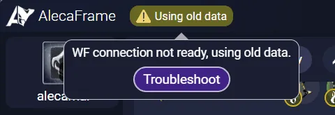
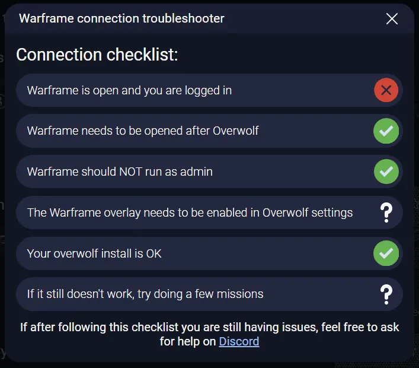

# Connecting your Warframe inventory to AlecaFrame

Once AlecaFrame and Warframe are running, AlecaFrame will periodically get inventory updates as you play the game.

If you have a very large Warframe inventory (lots of upgraded mods / a lot of warframe configs), it might take longer for your data to sync. Check the [Forcing an inventory update](#forcing-an-inventory-update) section for more info.

If you are having issues connecting your account, you can check the **troublehsooter**:

These issues/limitations nearly always come from the Overwolf integration with Warframe, which is far from perfect. 

Unfortunatelly, there isn't usually much I can do about it, but feel free to join the Discord server if you are unable to connect your account after a while.  

## Forcing an inventory update

If the data AlecaFrame has is out of date or you want to force an update, you can always travel to a **relay** (Strata Relay in Earth works fine) or a your **clan dojo** and back until the data updates. (You might need to do this 2-3 times before it works)

## AlecaFrame ToS and EULA compliance

AlecaFrame uses Overwolf to access your Warframe inventory data in a way that is compliant with Warframe's ToS and EULA. Check out [this](https://docs.alecaframe.com/faq#g1-is-alecaframe-safe-to-use) question in the FAQ for more information.
