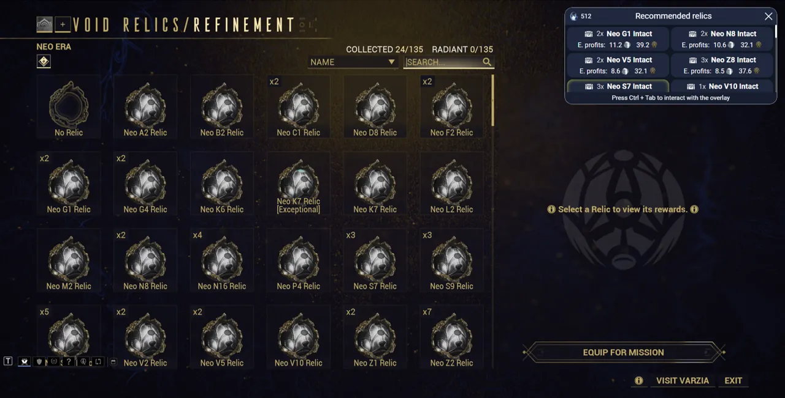

# Relic Recommendation Overlay

The relic recommendation overlay will automatically popup whenever you are prompted to select a relic for a void fissure mission.

This overlay displays the exact same information as the [Relic Planner](/features/relic-planner.html) tab.

## Using custom filters

If your goal is to for example farm ducats or farming a set of parts, you can also customize the filters and ordering mode this overlay uses.

To do that, go to the [Relic Planner](/features/relic-planner.html) tab in the main window of AlecaFrame, filter and order your relics as you want, and then press the arrow icon in the top-right corner to send them to the overlay. The overlay will now be using those filters.

If you want to reset them, just remove all filters in the [Relic Planner](/features/relic-planner.html) tab, and press the arrow button to apply them to the overlay.

Some commonly used filter configurations are:

- Order by "Ducats profit": Useful if you just want to get as many ducats as possible for Baro
- Order by "Best for MR": Great if you just want to open relics that will help you build new items (and level up your account)
- Use the filter "Favorite: Order first": This will put any relics containing items marked as favorite at the top.

## Outdated data in infinite missions

If you are running an infinite void fissure mission, the inventory data that AlecaFrame uses might get outdated pretty fast, since it is only updated during loading screens. This might make the overlay show relics that you don't own anymore.

You can either just ignore the missing ones, or exit the inifinite mission to let AlecaFrame receive updated inventory data.

## Language compatibility

Check [this table](/language-compatibility.html) for more information.

