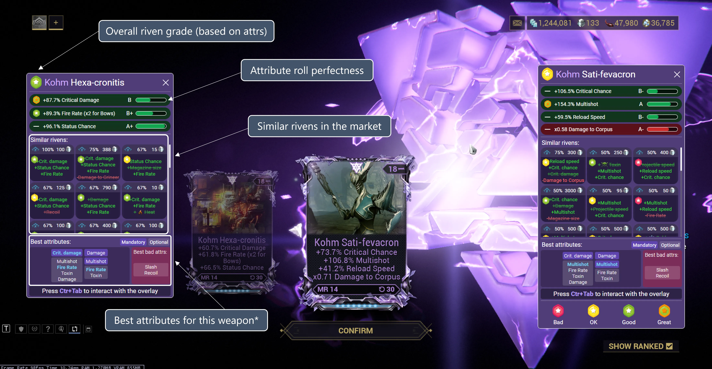

# Riven Reroll Overlay

The riven reroll overlay will automatically popup whenever you select a riven for rerolling.

The left side of the overlay will always show the old riven after a reroll. The right side will show the stats of the new riven you just rerolled.

## Riven grading system
More detailed information about the riven grading system can be found [here](/features/riven-explorer.html).

## Language compatibility

Check [this table](/language-compatibility.html) for more information.